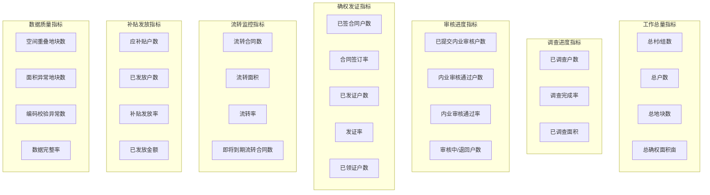
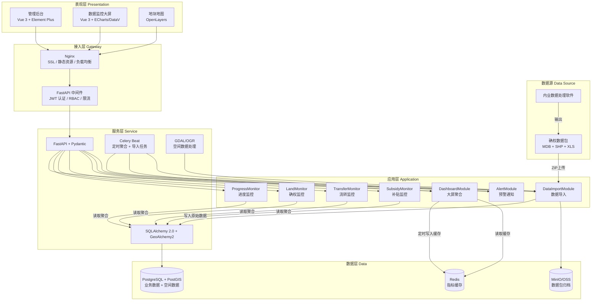
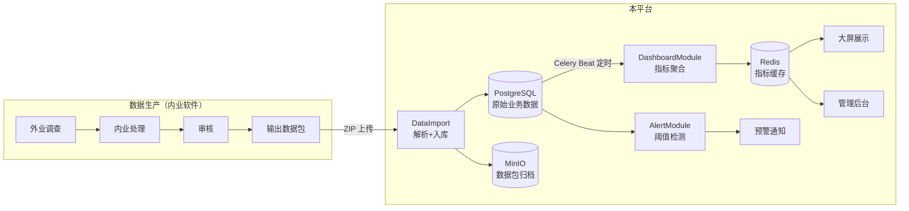

# 农经权数据监控可视化平台 — 概要设计文档

> **文档版本**：v1.0  
> **编制日期**：2025-07-11  
> **文档状态**：待需求确认后定稿  
> **版本变更**：v0.3 → v1.0，项目定位从"全功能业务管理系统"修正为"数据监控可视化平台"

---

## 一、项目定位与核心场景

### 1.1 系统定位

本系统**不是**业务操作管理系统，而是面向管理层的**数据监控可视化平台**。

核心定位：内业数据处理软件负责数据生产，本平台负责**接入处理成果、统计聚合、可视化呈现**，让各级领导一目了然掌握项目进度。

### 1.2 核心使用场景

```
内业数据处理软件 → 输出确权数据包 → 本平台导入 → 自动聚合统计 → 大屏/看板展示
                                                              ↓
                                                        领导随时查看
                                                     "宁远村总共多少户？
                                                      已调查多少户？
                                                      已交内业审核多少户？
                                                      审核通过多少户？"
```

### 1.3 用户角色

| 角色 | 核心诉求 | 使用方式 |
|------|----------|----------|
| 省级领导 | 全省进度总览、横向对比 | 大屏 / 总览看板 |
| 市级领导 | 本市各区县进度对比 | 市级看板 |
| 县级领导 | 各乡镇/村组进度明细 | 县级看板 + 村组下钻 |
| 项目管理员 | 发现进度滞后区域、推动调度 | 进度看板 + 预警提醒 |
| 数据管理员 | 导入数据、校验数据质量 | 后台管理页面 |

### 1.4 与内业软件的边界

| 职责 | 归属 | 说明 |
|------|------|------|
| 外业调查数据采集 | 内业软件 | 本平台不涉及 |
| 数据编辑、审核流程 | 内业软件 | 本平台不涉及 |
| 确权数据包生产输出 | 内业软件 | 输出标准 MDB + Shapefile 格式 |
| **数据导入与聚合统计** | **本平台** | 接收输出成果，自动计算指标 |
| **进度监控可视化** | **本平台** | 核心功能 |
| **异常预警** | **本平台** | 进度滞后、数据异常提醒 |

---

## 二、待确认问题清单

| 编号 | 问题 | 影响范围 | 当前假设 |
|------|------|----------|----------|
| Q1 | 内业软件输出的数据包是定期批量导出，还是实时推送？每次导出是全量还是增量？ | 数据导入策略、统计时效性 | 暂按"定期批量全量导出"设计 |
| Q2 | 内业软件是否有中间状态数据（如"已调查但未审核"的状态标记）？若有，通过什么字段标识？ | 指标体系设计、进度状态定义 | 暂按数据包中已有状态字段推断，见第四章 |
| Q3 | 数据更新的频率要求？领导期望看到的数据时效性是"昨日""当日"还是"实时"？ | 大屏刷新策略、导入调度 | 暂按"每日更新"设计 |
| Q4 | 大屏是否需要投放至实体大屏（如指挥中心大屏）？分辨率和浏览器有特殊要求吗？ | 大屏布局设计、分辨率适配 | 暂按 1920×1080 标准大屏设计 |
| Q5 | 是否需要多级行政区划权限管控（省/市/县/乡/村）？不同级别领导看到的数据范围不同？ | 权限模型、数据过滤 | 暂按行政区划编码前缀过滤，五级可见范围 |
| Q6 | "审核通过"等状态是内业软件直接标记在数据包中，还是需要本平台二次判定？ | 统计逻辑、数据权威性 | 暂按"以内业数据包字段为准，平台不做二次判定" |
| Q7 | 是否需要对历史导入数据做版本对比（如本周 vs 上周进度变化）？ | 数据模型、趋势图设计 | 暂按"保留每次导入快照，支持趋势对比"设计 |
| Q8 | 数据安全等级要求？是否涉及等保备案？ | 安全架构 | 暂按等保二级基本要求 |
| Q9 | 是否需要移动端适配（领导手机查看）？ | 前端方案 | 暂不含，后续可扩展 |
| Q10 | 补贴数据是否也需要在此平台监控？还是补贴由另一系统管理？ | 模块范围 | 暂按"包含补贴发放进度监控"设计 |

---

## 三、数据源分析（基于 370199 测试县样本）

### 3.1 数据包目录结构

```
370199测试县/
├── 权属数据/
│   ├── 权属单位代码表.xls          ← 行政区划树（村/组层级）
│   ├── 370199测试县.mdb            ← 核心：12 张业务表
│   └── 承包方权属信息统计表.xls
├── 矢量数据/
│   ├── DK.shp / DK.dbf / DK.shx / DK.prj   ← 地块几何与属性（2920条）
│   ├── JZD.shp / JZD.dbf                    ← 界址点
│   └── JZX.shp / JZX.dbf                    ← 界址线
├── 栅格数据/
│   ├── 数字正射影像图/
│   └── 数字栅格地图/
└── 报告文档/
```

### 3.2 MDB 核心业务表与数据量

| 表名 | 中文名 | 记录数 | 关键字段 | 可推断的监控指标 |
|------|--------|--------|----------|-----------------|
| FBF | 发包方 | 7 | FBFBM, FBFMC, FBFFZRXM | — |
| CBF | 承包方（农户） | 1407 | CBFBM, CBFMC, CBFZJLX, CBFZJHM, CBFCYSL | 总户数、按村统计户数 |
| CBF_JTCY | 家庭成员 | 5088 | CBFBM, CYXM, YHZGX | 户均人口 |
| CBHT | 承包合同 | 1407 | CBHTBM, FBFBM, CBFBM, CBFS, CBQXQ, CBQXZ, HTZMJM, CBDKZS | 已签合同户数、合同覆盖率 |
| CBDKXX | 承包地块信息 | 2920 | CBFBM, CBHTBM, DKBM, CBJYQZBM, HTMJM | 地块数、确权面积 |
| CBJYQZ | 经营权证 | 1407 | CBJYQZBM, FZJG, FZRQ, QZSFLQ | 已发证户数、发证率 |
| CBJYQZDJB | 权证登记簿 | 1407 | CBJYQZBM, CBFS, CBQX | 权证登记数 |
| LZHT | 流转合同 | 0(样本空) | LZHTBM, CBFBM, SRFBM, LZFS, LZQXKSRQ, LZQXJSRQ | 流转率(需后续数据) |

### 3.3 编码体系

| 编码 | 格式 | 示例 | 层级含义 |
|------|------|------|----------|
| CBFBM | 18位 | 370199199202000029 | 省(2)+市(2)+县(2)+镇(3)+村(3)+组(2)+顺序号(4) |
| DKBM | 19位 | 3701991992020001001 | 省(2)+市(2)+县(2)+镇(3)+村(3)+组(2)+地块顺序号(4)+校验(1) |
| CBHTBM | 19位 | 同上格式 | 合同编码 |
| FBFBM | 14位 | 37019919920200 | 省(2)+市(2)+县(2)+镇(3)+村(3)+组(1) |

**关键**：所有编码前 12 位为村级行政区划代码，可通过前缀匹配实现"按村/镇/县"聚合统计。

### 3.4 坐标系

DK.prj 标识为 **EPSG:4527**（CGCS2000 3度带高斯-克吕格投影），导入时需转换为 WGS84 (EPSG:4326) 以支持 Web 地图渲染。

---

## 四、监控指标体系设计

> 本章为系统核心——平台的一切功能围绕指标展开。

### 4.1 指标总览



### 4.2 指标计算规则

#### 4.2.1 调查进度指标

> **待确认 Q2**：以下推断基于数据包字段逻辑，需与业务方确认实际状态定义。

| 指标 | 计算规则 | 数据来源 | 说明 |
|------|----------|----------|------|
| 总户数 | COUNT(DISTINCT CBF.CBFBM WHERE 行政区划前缀匹配) | CBF 表 | 按村/镇/县聚合 |
| 已调查户数 | COUNT(DISTINCT CBF.CBFBM WHERE 存在关联的 CBDKXX 记录) | CBF + CBDKXX | 有地块关联即视为已调查 |
| 调查完成率 | 已调查户数 / 总户数 × 100% | 计算 | — |

#### 4.2.2 审核进度指标

| 指标 | 计算规则 | 数据来源 | 说明 |
|------|----------|----------|------|
| 已提交内业审核户数 | COUNT(DISTINCT CBF.CBFBM WHERE 存在关联的 CBHT 记录) | CBF + CBHT | 有承包合同即视为已提交审核 |
| 内业审核通过户数 | COUNT(DISTINCT CBF.CBFBM WHERE 存在关联的 CBJYQZ 且 FZRQ 非空) | CBF + CBJYQZ | 有发证日期即视为审核通过 |
| 审核通过率 | 审核通过户数 / 已提交审核户数 × 100% | 计算 | — |

#### 4.2.3 确权发证指标

| 指标 | 计算规则 | 数据来源 | 说明 |
|------|----------|----------|------|
| 已签合同户数 | COUNT(DISTINCT CBHT.CBFBM) | CBHT | — |
| 合同签订率 | 已签合同户数 / 总户数 × 100% | 计算 | — |
| 已发证户数 | COUNT(DISTINCT CBJYQZ.CBJYQZBM WHERE FZRQ IS NOT NULL) | CBJYQZ | — |
| 发证率 | 已发证户数 / 已签合同户数 × 100% | 计算 | — |
| 已领证户数 | COUNT(DISTINCT CBJYQZ.CBJYQZBM WHERE QZSFLQ = '1') | CBJYQZ | QZSFLQ=1 表示已领取 |

#### 4.2.4 流转监控指标

| 指标 | 计算规则 | 数据来源 | 说明 |
|------|----------|----------|------|
| 流转合同数 | COUNT(LZHT.LZHTBM) | LZHT | 样本中为空，待后续数据 |
| 流转面积 | SUM(LZHT.LZMJM) | LZHT | 亩 |
| 流转率 | 流转面积 / 总确权面积 × 100% | 计算 | — |
| 即将到期流转合同 | COUNT(LZHT WHERE LZQXJSRQ BETWEEN NOW() AND NOW()+90天) | LZHT | 90天内到期 |

#### 4.2.5 补贴发放指标

| 指标 | 计算规则 | 数据来源 | 说明 |
|------|----------|----------|------|
| 应补贴户数 | COUNT(DISTINCT CBF WHERE 确权面积 > 0) | 计算 | — |
| 已发放户数 | COUNT(DISTINCT SubsidyPayment WHERE status='已发放') | 补贴发放表 | — |
| 补贴发放率 | 已发放户数 / 应补贴户数 × 100% | 计算 | — |
| 已发放金额 | SUM(SubsidyPayment.amount) | 补贴发放表 | — |

#### 4.2.6 数据质量指标

| 指标 | 计算规则 | 数据来源 | 说明 |
|------|----------|----------|------|
| 空间重叠地块数 | COUNT(DK WHERE ST_Intersects 逻辑) | LandParcelGeom | PostGIS 空间运算 |
| 面积异常地块数 | COUNT(DK WHERE SCMJM <= 0 OR SCMJM > 合理上限) | DK | — |
| 编码校验异常数 | COUNT(记录 WHERE 编码前12位不在行政区划树中) | 全表 | — |
| 数据完整率 | (总记录 - 异常记录) / 总记录 × 100% | 计算 | — |

### 4.3 指标聚合粒度

所有指标支持按以下粒度聚合，通过编码前缀匹配实现：

| 粒度 | 编码截取 | 示例 |
|------|----------|------|
| 省级 | 前 2 位 | 37 |
| 市级 | 前 4 位 | 3701 |
| 县级 | 前 6 位 | 370199 |
| 镇级 | 前 9 位 | 370199199 |
| 村级 | 前 12 位 | 370199199202 |
| 组级 | 前 14 位 | 37019919920201 |

---

## 五、技术选型建议

### 5.1 选型原则

本平台以**数据展示**为核心，选型偏向：
- 前端渲染性能优先（大屏大量图表/地图）
- 后端轻量高效（聚合查询为主，无复杂业务流程）
- 数据导入稳定可靠（批量处理 Shapefile/MDB）

### 5.2 后端方案

| 组件 | 选型 | 理由 |
|------|------|------|
| Web 框架 | **FastAPI** | 异步高性能，适合大屏高并发读；自动生成 Swagger 文档 |
| ORM | **SQLAlchemy 2.0** | 复杂聚合查询支持好，配合 GeoAlchemy2 处理空间数据 |
| 空间数据 | **GeoAlchemy2 + PostGIS** | 地块多边形存储与空间运算 |
| 数据库迁移 | **Alembic** | 版本管理 |
| 异步任务 | **Celery + Redis** | 数据包批量导入、指标定时聚合 |
| 空间数据处理 | **GDAL/OGR** | Shapefile 读取、EPSG:4527→4326 坐标转换、MDB 解析 |
| ASGI 部署 | **Uvicorn + Gunicorn** | 生产级部署 |

### 5.3 前端方案

| 层次 | 选型 | 理由 |
|------|------|------|
| 框架 | **Vue 3 + TypeScript** | 生态成熟，组件库丰富 |
| UI 组件 | **Element Plus** | 政务风格表格/表单/导航 |
| 图表 | **ECharts 5** | 地图组件支持村级渲染；大屏适配方案成熟 |
| 大屏装饰 | **DataV** | 大屏边框/装饰/飞线等特效 |
| 地图 | **OpenLayers** | GeoJSON 渲染能力强，支持地块多边形叠加 |
| 构建 | **Vite** | 快速构建 |

### 5.4 数据库与中间件

| 组件 | 选型 | 理由 |
|------|------|------|
| 主数据库 | **PostgreSQL 16 + PostGIS 3.4** | GIS 空间查询；聚合统计性能好 |
| 缓存 | **Redis 7** | 聚合指标缓存（大屏秒级响应）；Celery Broker |
| 文件存储 | **MinIO / OSS** | 原始数据包归档、确权证扫描件 |

---

## 六、系统架构图



### 分层说明

| 层次 | 职责 | 关键约束 |
|------|------|----------|
| 数据源 | 内业软件输出标准确权数据包 | 平台不参与数据生产 |
| 表现层 | 可视化展示 + 简易后台管理 | 只读展示为主，仅数据导入有写操作 |
| 接入层 | 认证鉴权、限流 | 所有请求经认证 |
| 应用层 | 指标计算、聚合统计、预警检测 | 以读和计算为主，非 CRUD 操作 |
| 服务层 | 框架级支撑 | — |
| 数据层 | 持久化 + 缓存 | 聚合指标走 Redis 缓存 |

---

## 七、模块划分

### 7.1 模块总览

```
农经权数据监控可视化平台
├── DataImportModule       # 数据导入模块
├── ProgressMonitor        # 调查进度监控
├── LandMonitor            # 确权发证监控
├── TransferMonitor        # 流转状态监控
├── SubsidyMonitor         # 补贴发放监控
├── DashboardModule        # 大屏数据聚合
└── AlertModule            # 预警通知模块
```

### 7.2 各模块职责

#### DataImportModule — 数据导入

| 项目 | 说明 |
|------|------|
| 职责 | 接收内业软件输出的确权数据包，解析入库、校验、归档 |
| 导入流程 | ①上传 ZIP → ②Celery 异步解压 → ③解析 XLS 建行政区划树 → ④读 MDB 入业务表 → ⑤读 SHP 经 GDAL 坐标转换 → ⑥校验 → ⑦触发指标重聚合 |
| 校验内容 | 编码合法性、面积合理性、空间重叠检测、关联完整性 |
| 核心实体 | ImportTask, ImportErrorLog |

#### ProgressMonitor — 调查进度监控

| 项目 | 说明 |
|------|------|
| 职责 | 按村/镇/县展示调查工作进度 |
| 核心接口 | 村级进度列表、镇级汇总、县级汇总、进度排名 |
| 可视化 | 进度条、排名表、趋势折线 |

#### LandMonitor — 确权发证监控

| 项目 | 说明 |
|------|------|
| 职责 | 监控合同签订率、发证率、领证率、确权面积 |
| 核心接口 | 各村发证率、地块空间分布、面积统计 |
| 可视化 | 地图着色（按发证率分级设色）、面积饼图、发证进度条 |

#### TransferMonitor — 流转状态监控

| 项目 | 说明 |
|------|------|
| 职责 | 监控土地流转率、流转面积、到期预警 |
| 核心接口 | 流转率统计、即将到期合同列表、流转方式分布 |
| 可视化 | 流转率地图、到期时间线、流转方式饼图 |

#### SubsidyMonitor — 补贴发放监控

| 项目 | 说明 |
|------|------|
| 职责 | 监控补贴发放进度、发放金额、发放覆盖率 |
| 核心接口 | 发放率统计、金额汇总、未发放清单 |
| 可视化 | 发放进度条、金额柱状图、覆盖率地图 |

#### DashboardModule — 大屏数据聚合

| 项目 | 说明 |
|------|------|
| 职责 | 定时聚合所有指标，缓存至 Redis，提供大屏秒级查询接口 |
| 聚合策略 | Celery Beat 每 5 分钟（可配置）扫描并重算指标 |
| 缓存结构 | `dashboard:{level}:{code}` → JSON（包含该层级所有指标值） |
| 性能目标 | 大屏接口响应 ≤ 300ms |

#### AlertModule — 预警通知

| 项目 | 说明 |
|------|------|
| 职责 | 基于指标阈值自动生成预警 |
| 预警类型 | 进度滞后预警（调查完成率低于阈值）、流转到期预警（90天内到期）、数据质量预警（异常率超阈值） |
| 通知方式 | 站内消息（预留短信/邮件扩展） |

---

## 八、数据流向

### 8.1 端到端数据流



### 8.2 数据导入详述

```
1. 数据管理员上传 ZIP 包

2. Celery Worker 异步处理
   ├─ 解压 ZIP
   ├─ 解析「权属单位代码表.xls」→ AdminDivision（行政区划树）
   ├─ 解析 MDB → 写入业务表
   │   FBF         → Issuer
   │   CBF         → Contractor
   │   CBF_JTCY    → FamilyMember
   │   CBHT        → Contract
   │   CBDKXX      → LandParcel（属性）
   │   CBJYQZ      → LandCertificate
   │   LZHT        → TransferContract（如有）
   ├─ 解析 DK.shp → GDAL 坐标转换(EPSG:4527→4326) → LandParcelGeom（空间）
   └─ 校验
       · 编码合法性：CBFBM/DKBM 前12位必须在行政区划树中
       · 面积合理性：0 < SCMJM ≤ 合理上限
       · 空间重叠：ST_Intersects 检测
       · 关联完整性：CBDKXX.DKBM 必须存在

3. 导入完成后自动触发指标重聚合

4. 原始 ZIP 包归档至 MinIO（审计用）
```

### 8.3 指标聚合流程

```
Celery Beat (每5分钟)
  │
  ├─ 扫描 PostgreSQL 原始数据
  ├─ 按行政区划层级聚合（县/镇/村/组）
  │   ├─ COUNT/DISTINCT COUNT → 户数、地块数
  │   ├─ SUM → 面积、金额
  │   ├─ 比率计算 → 完成率、通过率、流转率
  │   └─ ST_ 聚合 → 空间统计
  │
  ├─ 写入 Redis 缓存
  │   dashboard:village:370199199202 → { 总户数:156, 已调查:120, ... }
  │   dashboard:town:370199199 → { 总户数:1407, 已调查:980, ... }
  │   dashboard:county:370199 → { ... }
  │
  └─ 检测预警阈值
      ├─ 调查完成率 < 50% → 进度滞后预警
      ├─ 流转合同90天内到期 → 到期预警
      └─ 数据异常率 > 5% → 质量预警
```

---

## 九、数据库核心表设计（概要）

### 9.1 行政区划

| 实体 | 关键字段 | 来源 | 说明 |
|------|----------|------|------|
| AdminDivision | code(PK), name, parent_code, level | 权属单位代码表.xls | 行政区划树 |

### 9.2 业务原始数据（只写，由导入模块写入）

| 实体 | 关键字段 | 来源 | 说明 |
|------|----------|------|------|
| Issuer | fbfbm(PK), fbfmc, fzr_xm | FBF | 发包方 |
| Contractor | cbfbm(PK), cbfmc, cbfzjhm_encrypted, cbfcysl | CBF | 承包方（农户） |
| FamilyMember | id, cbfbm(FK), cyxm, yhzgx | CBF_JTCY | 家庭成员 |
| Contract | cbhtbm(PK), fbfbm, cbfbm, cbqxq, cbqxz, htmjm | CBHT | 承包合同 |
| LandParcel | dkbm(PK), dkmc, cbfbm, cbhtbm, cbjyqzbm, syqxz, dklb, scmjm, htmjm, dkdz, dkxz, dknz, dkbz | DK.dbf + CBDKXX | 地块属性 |
| LandParcelGeom | id, dkbm(FK), geom(GEOMETRY(POLYGON,4326)) | DK.shp | 地块空间（转换后） |
| LandCertificate | cbjyqzbm(PK), fzjg, fzrq, qzsflq | CBJYQZ | 经营权证 |
| TransferContract | lzhtbm(PK), cbhtbm, cbfbm, srfbm, lzfs, lzxksrq, lzxjsrq, lzmjm | LZHT | 流转合同 |

### 9.3 指标缓存（Redis，由 DashboardModule 写入）

| Key 模式 | 值内容 | 说明 |
|----------|--------|------|
| `dashboard:village:{code}` | { total_households, surveyed, submitted_audit, audit_passed, contracted, certificated, ... } | 村级指标 |
| `dashboard:town:{code}` | 同上（镇级聚合） | 镇级指标 |
| `dashboard:county:{code}` | 同上（县级聚合） | 县级指标 |
| `dashboard:province:{code}` | 同上（省级聚合） | 省级指标 |

### 9.4 系统支撑表

| 实体 | 关键字段 | 说明 |
|------|----------|------|
| ImportTask | id, package_filename, status, total_count, success_count, error_count | 导入任务 |
| ImportErrorLog | id, task_id, row_number, table_name, error_message | 导入错误 |
| AlertRule | id, rule_type, threshold, is_active | 预警规则 |
| AlertEvent | id, rule_id, alert_date, status, detail | 预警事件 |
| DictItem | id, category, code, name | 字典表（SYQXZ/DKLB等编码翻译） |
| Snapshot | id, snapshot_date, level, code, metrics_json | 历史快照（支持趋势对比） |
| AuditLog | id, user_id, action, entity_id, created_at | 审计日志 |

### 9.5 关键索引策略

| 表 | 索引 | 类型 | 用途 |
|----|------|------|------|
| LandParcelGeom | idx_geom | GIST | 空间查询/地图渲染 |
| LandParcel | idx_parcel_cbfbm | B-Tree | 按承包方聚合 |
| LandParcel | idx_parcel_prefix | B-Tree (函数) | 按行政区划前缀聚合 |
| Contractor | idx_contractor_prefix | B-Tree (函数) | 按行政区划前缀聚合 |
| Contract | idx_contract_cbqxz | B-Tree | 到期扫描 |
| TransferContract | idx_transfer_lzxjsrq | B-Tree | 流转到期扫描 |

---

## 十、大屏页面设计（概要）

### 10.1 页面布局

```
┌─────────────────────────────────────────────────────────────┐
│  [标题] 农经权数据监控平台    [日期] [刷新按钮] [全屏]       │
├──────────────┬──────────────────────────┬───────────────────┤
│              │                          │                   │
│  左侧指标区  │      中央地图区           │   右侧指标区      │
│              │                          │                   │
│  ● 总户数    │   行政区划地图            │  ● 发证率         │
│  ● 调查率    │   村级色块着色            │  ● 领证率         │
│  ● 审核通过率│   (按发证率/调查率)       │  ● 流转率         │
│  ● 合同签订率│                          │  ● 补贴发放率     │
│              │                          │                   │
├──────────────┴──────────────────────────┴───────────────────┤
│                      底部趋势区                              │
│  ● 调查进度趋势折线    ● 发证进度趋势    ● 流转面积趋势      │
└─────────────────────────────────────────────────────────────┘
```

### 10.2 下钻交互

```
省级总览 → 点击某市 → 市级看板 → 点击某县 → 县级看板 → 点击某镇 → 镇级看板 → 点击某村 → 村级详情

村级详情弹窗：
┌──────────────────────────────────┐
│  XX村 进度详情                    │
├──────────────────────────────────┤
│  总户数: 156    已调查: 120       │
│  已提交审核: 98  审核通过: 87     │
│  已签合同: 85   已发证: 80       │
│  已领证: 72     流转中: 12户     │
│                                  │
│  [进度条可视化]                   │
│  [地块地图小窗]                   │
└──────────────────────────────────┘
```

---

## 十一、非功能性设计要点

| 维度 | 设计要求 |
|------|----------|
| **性能** | 大屏接口 ≤ 300ms（Redis 缓存）；地图渲染 ≤ 1s（前端矢量切片或简化多边形） |
| **安全** | JWT 认证 + 行政区划数据范围过滤；身份证号加密存储、脱敏展示 |
| **可靠** | 导入任务失败重试（3次）；数据包归档至 MinIO 可追溯 |
| **可扩展** | 指标体系可配置（新增指标仅需修改聚合逻辑 + 前端图表） |
| **时效性** | Celery Beat 定时聚合（默认5分钟）；手动触发重聚合接口 |
| **可维护** | OpenAPI 自动文档；Alembic 版本管理；structlog JSON 日志 |

---

## 十二、下一步工作建议

1. **指标确认**：与业务方逐项确认第四章指标计算规则，特别是"调查/审核"状态的字段推断逻辑
2. **大屏原型**：产出大屏页面原型设计，确认布局与交互
3. **历史快照**：确认是否需要趋势对比功能（若需要，需设计 Snapshot 表与定时快照策略）
4. **迭代开发**：
   - **P0**：DataImportModule（数据导入）+ DashboardModule（大屏聚合）+ 大屏前端
   - **P1**：ProgressMonitor + LandMonitor（进度与确权监控看板）
   - **P2**：TransferMonitor + SubsidyMonitor + AlertModule（流转/补贴/预警）
5. **字典表梳理**：对照农业部标准完善 SYQXZ/DKLB/TDLYLX/DLDJ/LZFS 等编码字典

---

> **备注**：本文档为概要设计 v1.0，核心变更：项目定位从"全功能业务管理系统"修正为"数据监控可视化平台"，聚焦指标体系设计、大屏展示、进度监控，弱化 CRUD 操作。数据来源为内业软件输出，本平台以只读展示和聚合统计为主。
